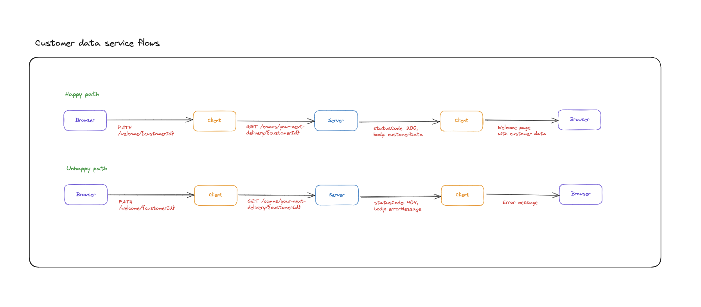
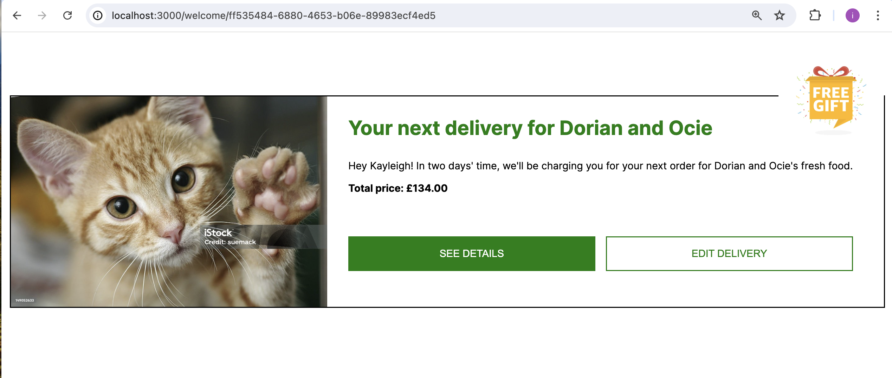
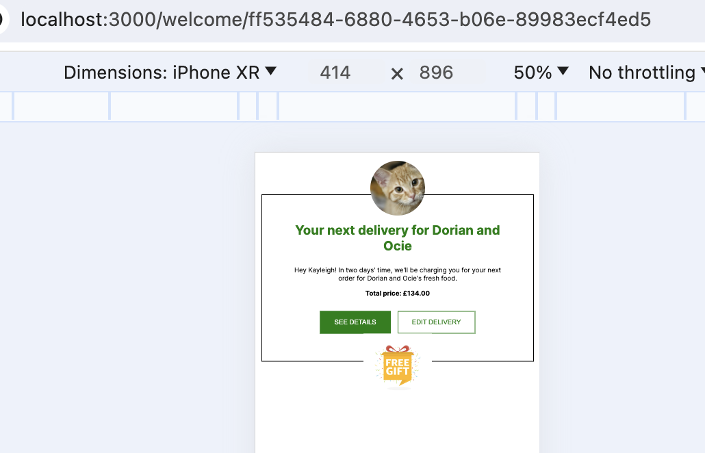
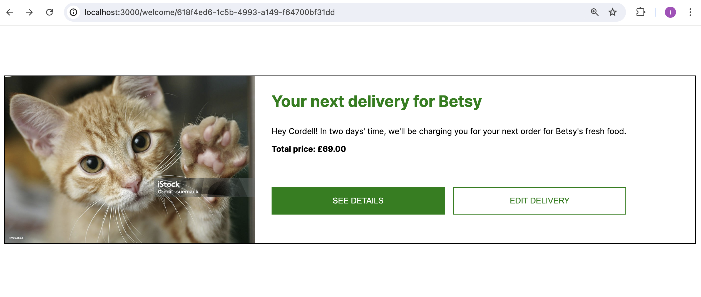
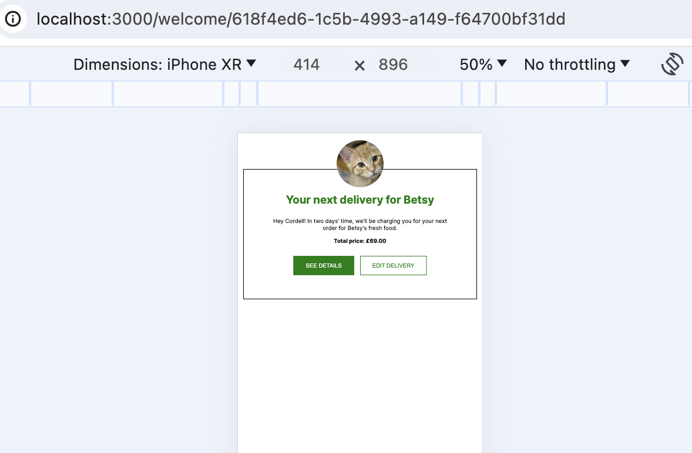
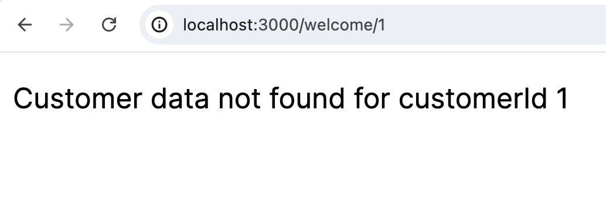
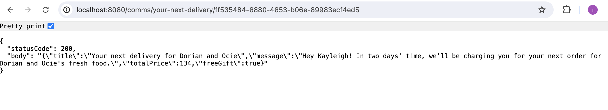
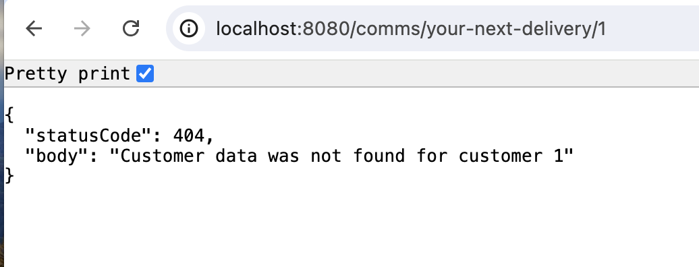

# Customer data service

Task description can be found in the TASK.md file.

Author: Ioana Comsa

## Application behaviour on high level
Customer data is retrieved from the `server/data.json` data store and is surfaced on the customer's `Welcome` page.

## Data journey flow

**Happy path** - Customer data is found and returned given a customer id
**Unhappy path** - Customer data is not found given a customer id



## Screenshots

### Client

**Happy path** - Customer data is found and returned given a customer id

http://localhost:3000/welcome/ff535484-6880-4653-b06e-89983ecf4ed5




http://localhost:3000/welcome/618f4ed6-1c5b-4993-a149-f64700bf31dd




**Unhappy path** - Customer data is not found given a customer id

http://localhost:3000/welcome/1



### Server

**Happy path** - Customer data is found and returned given a customer id

http://localhost:8080/comms/your-next-delivery/ff535484-6880-4653-b06e-89983ecf4ed5



**Unhappy path** - Customer data is not found given a customer id

http://localhost:8080/comms/your-next-delivery/1



## Libraries/Tools used

**Client**

* React
* Next.js
* TypeScript
* Jest
* @testing-library
* Eslint
* Prettier

**Server**

* Nest.js
* Express
* TypeScript
* Jest
* Supertest
* Eslint
* Prettier

## Setup

### Install npm packages

**Client**

```
cd client
npm install
```

**Server**

```
cd server
yarn
```

### Running the application locally

```
cd client
npm run dev
```

The command will concurrently run the server and the client

### Running the tests

**Client**

```
cd client
npm run test
```

**Server**

```
cd server
npm run test
```


